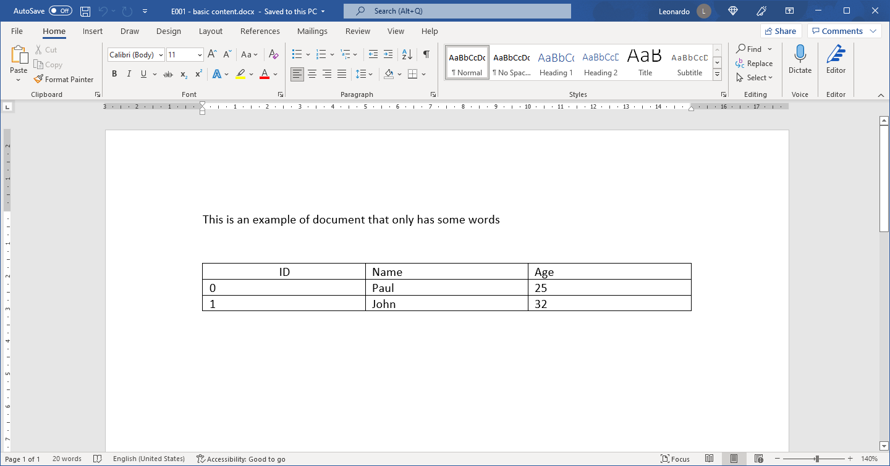

.. Fuzzy Table Extractor documentation master file, created by
   sphinx-quickstart on Sat Jan 22 08:50:41 2022.
   You can adapt this file completely to your liking, but it should at least
   contain the root `toctree` directive.

Welcome to Fuzzy Table Extractor's documentation!
=================================================

Fuzzy Table Extractor is a library for extracting tables from documents.
In the current version only Microsoft Word documents are supported, but in the future the library will be expanded to cover pdf, web and other types of documents.

What can Fuzzy Table Extractor do?
----------------------------------

It can finds tables in documents based on a target header, searching all tables in document and returing the one that has the most similar header, using a fuzzy search algorithm.

It's available on PyPI, so the installation can be done with pip:

.. code-block:: console

   pip install fuzzy-table-extractor

To extract a table from a simple document like this:

We need just a few lines of code:

.. code-block:: python

   from pathlib import Path

   from fuzzy_table_extractor.handlers.docx_handler import DocxHandler
   from fuzzy_table_extractor.extractor import Extractor, FieldOrientation

   path = r"path_to_document.docx"

   file_path = Path(path)
   handler = DocxHandler(file_path)

   extractor = Extractor(handler)
   df = extractor.extract_closest_table(["name", "age"])
   print("This is the result extraction of a very simple document:")
   print(df)

And the result is a pandas dataframe with the following content:

.. code-block:: console

   name age
   0  Paul  25
   1  John  32

Note that the dataframe returned only has the coluns specified as search headers. The closest column in the original table is selected and renamed to value passed to the function.

.. note::
   This is a development version of Fuzzy Table Extractor.

.. toctree::
   :maxdepth: 2
   :caption: Contents:

Contents
--------
.. toctree::
   installation
   usage/basic_usage
   api/extractor
   api/handlers/base_handler
   api/handlers/docx_handler